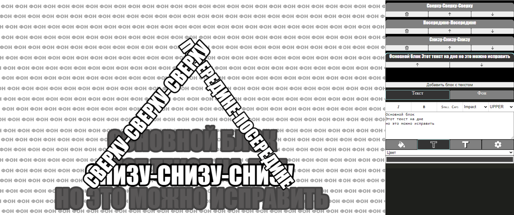
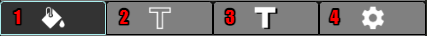
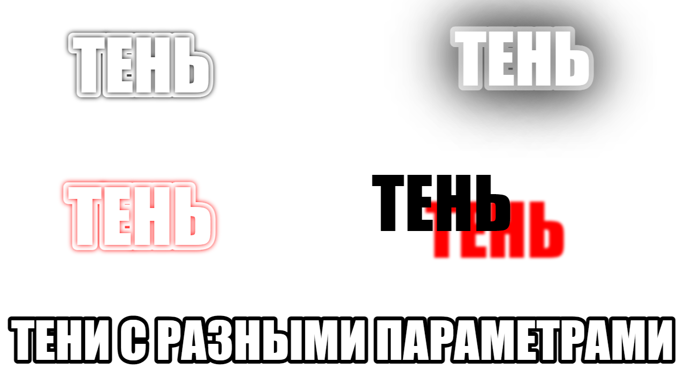
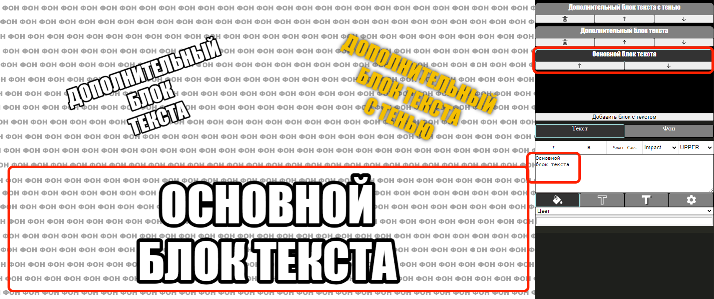

# Справка

Memaker - онлайн-редактор мемов, в планах похожий на смесь GIMP и Power Point, основная цель которого заключается в автоматизации рутины при создании мемов.

# Хоткеи
|Сочетание клавиш|Действие|Условия|
|---|---|---|
|Ctrl + Z|Отмена действия (Undo)||
|Ctrl + Shift + Z|Повтор отменённого действия (Redo)||
|Ctrl + V|Вставить изображение из буфера обмена в качестве фона текущего фрейма|Когда ни одно из текстовых полей ввода не в фокусе|
|Arrow Left/Arrow Right|Сменить текущий фрейм на следующий|Когда ни одно из текстовых полей ввода не в фокусе|
|Shift, Ctrl|Переключают режимы модификаторов текстовых блоков|Во время модификации блока (масштабирование, перемещение, поворот)|

ПКМ по рендеру текущего фрейма позволяет скопировать или сохранить его (зависит от браузера). Элементы UI (границы блоков) при этом не будут скопированы.

# Обзор интерфейса
Первоначальная задача: удобное размещение текста с обводкой на многокартиночных мемах.
Поэтому проект мема состоит из нескольких фреймов. Внутри одного фрейма может быть фоновая картинка, основной текст и произвольное количество текстовых блоков.

Интерфейс состоит из трёх секций.
- Левая панель отвечает за мем в целом: тут список фреймов и возможности по сохранению/загрузке/рендеру мема.
- Правая панель отвечает за работу с содержимым текущего фрейма - тут задаются параметры текста.
- По центру отображается текущий фрейм и выделенный тестовый блок.

# Текущий фрейм

Фрейм - это одна картинка на фоне, один основной текстовый блок и набор дополнительных текстовых блоков. Похоже на слайды в презентациях.

## Фон

По умолчанию в качестве фона у фрейма оказывается одна из заглушек. Фон можно заменить следующими способами:

1. Вставить из буфера обмена с помощью `Ctrl + V`.
1. Перетащить изображение откуда-нибудь мышкой.
1. На правой панели, открыть вкладку "Фон" и выбрать файл на устройстве. .

## Текстовые блоки

Текстовые блоки бывают двух видов: основной и дополнительный. Они отличаются позиционированием и подбором размера шрифта.

Размер текста в блоках подбирается автоматически, исходя из типа блока, перенос текста на новую строку выполняется пользователем.

Выбирать, добавлять, удалять и менять порядок блоков можно на панели справа. От порядка блоков зависит их отрисовка.

### Настройки шрифта

На панели над вводом текста содержатся настройки шрифта
1. Курсив.
2. Жирность.
3. Большие строчные (как капитель).
4. Выбор шрифта из набора.
5. К какому регистру приводить текст: все прописными (`UPPER`), все строчными (`lower`) или как написано (`As is`).

Текущий набор шрифтов:

### Настройки отрисовки

Под вводом текста есть набор вкладок для настройки отрисовки текста.

1. Заливка.
2. Обводка.
3. Тень.
4. Экспериментальные настройки - их наличие в будущих версиях гарантируется ещё меньше, чем других фич, они могут быть удалены/переработаны
   или перенесены в другую группу настроек.

#### Заливка и обводка
Заливка текста и обводки настраиваются идентично: они могут быть отключены, залиты монотонным цветом или паттерном из набора.

#### Тень
Тень может быть выключена, если же она включена, то её отбрасывает как сам текст, так и его обводка. У неё можно настроить цвет, сдвиг и размытие.

#### Экспериментальные настройки
* Толщина обводки - в процентах от размера шрифта. От толщины обводки также зависит междустрочный интервал.
* Коэффициент для интервала - регулирует междустрочный интервал, который зависит от этого коэффициента, максимальной высоты строки и толщины обводки.
  Если нужно, чтоб строчки были ближе друг к другу - уменьшаем, иначе увеличиваем.
* Точка интерполяции шрифта - для оптимизации подбора размера шрифта в дополнительных блоках, зависимость ширины строки от высоты шрифта принимается линейной и
  с помощью вычисления ширины строки при заданной высоте шрифта строится линейное приближение. Изменение этого параметра может как-то повлиять на вписывание текста в блок.

### Основной текстовый блок

Каждый фрейм содержит неудаляемый текстовый блок снизу, чьё расположение вычисляется автоматически так, 
чтобы соблюдались отступы от краёв - отступ снизу зависит от подобранного размера шрифта. 

Если отступы по краям слишком маленькие, пока что можно либо добить по краям пробелами, либо заменить на дополнительный блок.

### Дополнительные текстовые блоки

Дополнительные блоки могут быть созданы с помощью кнопки под списком текстовых блоков, иметь произвольный размер, позицию и поворот.

|N|Модификатор|Ctrl|Shift|
|-----|-----------|----|-----|
|1|Изменение ширины/высоты симметрично относительно центра|Ассиметрично|С шагом 10 пикселей|
|2|Одновременное изменение ширины и высоты относительно центра|Ассиметрично|С сохранением пропорций|
|3|Свободное перемещение блока|-|-|
|4|Перемещение перпендикулярно ориентации блока|Вертикальное перемещение|С шагом 10 пикселей|
|5|Перемещение вдоль ориентации блока|Горизонтальное перемещение|С шагом 10 пикселей|
|6|Поворот|Сброс поворота в ноль|С шагом 45 градусов|

# Мем как набор фреймов

Проект мема состоит из списка фреймов. Мем можно сохранить в виде meme файла, отрендерить, выгрузить текст в csv.

## Добавление фреймов
1. Внизу списка фреймов есть кнопка "Добавить фрейм", она создаст новый фрейм с фоном-заглушкой в конце списка фреймов.
2. Можно перетащить изображения из папки с файлами в область списка фреймов - для каждого изображения создастся новый фрейм, все фреймы будут добавлены в конец списка.

## Порядок фреймов

Порядок фреймов влияет на их отображение в списке и именование при рендере - они будут именоваться `<номер фрейма>.png`.
Менять порядок фреймов можно кнопками на миниатюре в списке фреймов.

## Удаление фреймов

Удаление фрейма возможно с помощью кнопки на его миниатюре. Это обратимое действие, как и многие другие.

